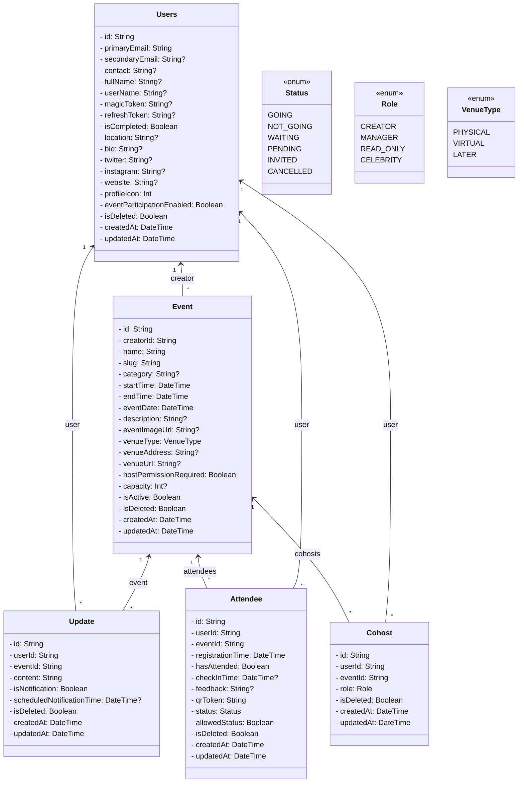

<!--horizontal divider(gradiant)-->

<!--h1 without bottom border-->

  <ul align="center">
    
<h1 style="display: inline-block">Hi 👋, I'm Pratish Ninawe</h1>

  </ul>

## UML Class Diagram

<!--h2 without bottom border-->

  <ul align="center">
    
<h2 style="display: inline-block">A Passionate Developer</h2>

  </ul>

<!--- description -->

  <ul align="center">
    

Hi, Welcome. I’m Pratish Ninawe, and I am passionate about coding and designing new things. I have completed my bachelor's in IT with background in Full Stack Web Engineer and I am a self-taught programmer. I am a Frontend Developer with 2 years of experience building scalable, user-centric web applications using JavaScript, React, and modern frameworks. Proficient in delivering robust solutions, collaborating in agile teams, and contributing to both frontend and backend development.

  </ul>

<!--Intro start-->
- 👯 I’m looking to collaborate on **on any technologies or framework**

- ☁️ I've keen interest in Web development.

- 💬 Ask me about **Reactjs, Nodejs, AWS, MongoDB, Devops**

- 📫 How to reach me **pratish.1006@gmail.com**

- 🏠 Have a look at my [Resume](https://docs.google.com/document/d/11dSCxeD7p5ydPSoxJ_0Kui2vFl-oW4RklmYUXuL9DpA/edit?usp=sharing).
<!--Intro end-->

<!--- stats & Trophy (start) -->

  <!--- stats (start) -->
<table align="center">
<tr border="none">
<td width="50%" align="center">
  
  
    
   
</td>

<td width="50%" align="center">

  
  
  </td>
</tr>
</table>
<!--- stats (end) -->

<!--- trophy (start) -->

  

<!--- trophy (end) -->

        
<!--- stats & Trophy (end) -->

<!--h1 without bottom border-->

  <ul align="center">
    
<h2 style="display: inline-block">Technologies That I Know👨🏻‍💻</h2>

  </ul>

<!--tech stack icons-->

  
                            

<!-- Connect with me -->
<!--h2 without bottom border-->

  <ul align="center">
    
<h2 style="display: inline-block">Connect With Me🤝</h2>

  </ul>

<!--icons and links-->

  

<!--profile visit count-->

  

  

  

<!--horizontal divider(gradiant)-->

